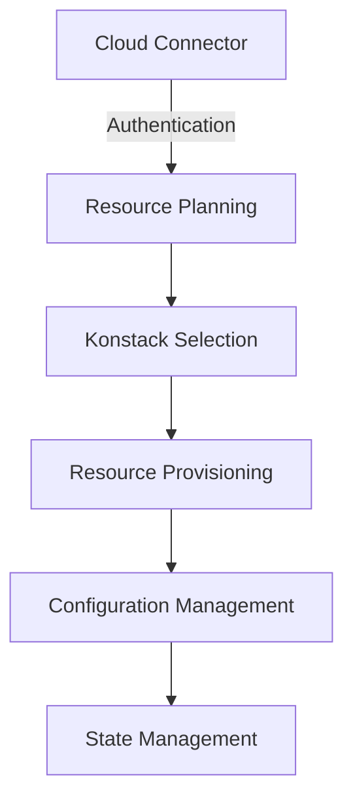
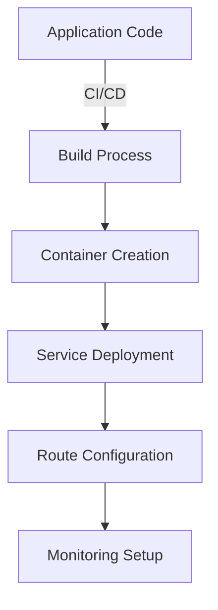

## Overview

Cloudsania operates as a sophisticated cloud orchestration platform that abstracts the complexity of multi-cloud deployments. Our platform seamlessly integrates with multiple cloud providers, offering a unified interface for managing cloud resources, automating deployments, and maintaining infrastructure.

## Architecture

<Tabs>
  <Tab title="Core Components">
    ### Platform Components
    <AccordionGroup>
      <Accordion title="Cloud Connectors" defaultOpen={true}>
        - Secure integration with cloud providers
        - Authentication and authorization management
        - Resource provisioning and management
        - Real-time state synchronization
      </Accordion>
      <Accordion title="Konstacks">
        - Pre-configured infrastructure templates
        - Automated resource provisioning
        - Environment-specific configurations
        - Multi-cloud deployment support
      </Accordion>
      <Accordion title="App Services">
        - Application deployment automation
        - Container orchestration
        - Service scaling and management
        - Load balancing and routing
      </Accordion>
    </AccordionGroup>
  </Tab>
  
  <Tab title="Infrastructure">
    ### Infrastructure Components
    <AccordionGroup>
      <Accordion title="Resource Management" defaultOpen={true}>
        - Multi-cloud resource orchestration
        - Infrastructure as Code (IaC)
        - State management and tracking
        - Resource optimization
      </Accordion>
      <Accordion title="Network Layer">
        - Secure communication channels
        - VPC and subnet management
        - DNS configuration and routing
        - Load balancing and traffic management
      </Accordion>
      <Accordion title="Security Layer">
        - Identity and access management
        - Encryption at rest and in transit
        - Security group management
        - Compliance monitoring
      </Accordion>
    </AccordionGroup>
  </Tab>
  
  <Tab title="Integration">
    ### Integration Layer
    <AccordionGroup>
      <Accordion title="Provider Integration" defaultOpen={true}>
        - AWS integration services
        - DigitalOcean connectivity
        - VPS management
        - Cross-provider orchestration
      </Accordion>
      <Accordion title="Third-party Services">
        - GitHub integration
        - CI/CD pipeline connections
        - Monitoring tool integration
        - DNS service providers
      </Accordion>
    </AccordionGroup>
  </Tab>
</Tabs>

## How It Works

<Steps>
  <Step title="Cloud Connection">
    1. Connect your cloud provider accounts
    2. Set up authentication and permissions
    3. Configure access policies
    4. Verify connectivity and access
  </Step>
  <Step title="Resource Management">
    1. Define infrastructure requirements
    2. Select appropriate Konstacks
    3. Configure environment settings
    4. Deploy and manage resources
  </Step>
  <Step title="Application Deployment">
    1. Set up deployment pipelines
    2. Configure application settings
    3. Deploy applications
    4. Monitor and scale services
  </Step>
  <Step title="Ongoing Operations">
    1. Monitor resource utilization
    2. Manage costs and optimization
    3. Handle updates and maintenance
    4. Ensure security compliance
  </Step>
</Steps>

## Key Workflows

### 1. Infrastructure Provisioning

<CodeGroup>

</CodeGroup>

### 2. Resource Management

<CardGroup cols={2}>
  <Card title="Automated Operations" icon="robot">
    - Resource provisioning
    - Scaling operations
    - Health monitoring
    - Backup management
  </Card>
  <Card title="Manual Operations" icon="user">
    - Configuration updates
    - Security management
    - Cost optimization
    - Troubleshooting
  </Card>
</CardGroup>

### 3. Security Implementation

<AccordionGroup>
  <Accordion title="Access Control" defaultOpen={true}>
    - Role-based access control (RBAC)
    - Multi-factor authentication
    - API key management
    - Session management
  </Accordion>
  <Accordion title="Data Security">
    - Encryption at rest
    - Encryption in transit
    - Key management
    - Audit logging
  </Accordion>
  <Accordion title="Network Security">
    - Firewall configuration
    - VPC security
    - Network isolation
    - Traffic monitoring
  </Accordion>
</AccordionGroup>

## Integration Capabilities

### Cloud Provider Integration

<CardGroup cols={3}>
  <Card title="AWS" icon="aws">
    Full AWS service integration
  </Card>
  <Card title="DigitalOcean" icon="digital-ocean">
    Complete DO resource management
  </Card>
  <Card title="VPS" icon="server">
    Custom VPS integration
  </Card>
</CardGroup>

### Third-party Services

<CardGroup cols={2}>
  <Card title="DevOps Tools" icon="gears">
    - GitHub integration
    - CI/CD pipelines
    - Monitoring tools
  </Card>
  <Card title="Network Services (DNS Configuration)" icon="globe">
    - Cloudflare integration
    - Route53 integration
    - Digital Ocean integration
  </Card>
</CardGroup>

## Best Practices

<Tabs>
  <Tab title="Resource Management">
    ### Resource Best Practices
    - Use appropriate instance sizes
    - Implement auto-scaling
    - Monitor resource utilization
  </Tab>
  <Tab title="Security">
    ### Security Best Practices
    - Enable MFA for all accounts
    - Regular security audits
    - Proper IAM configuration
    - Network security monitoring
  </Tab>
  <Tab title="Operations">
    ### Operational Best Practices
    - Regular backups
    - Disaster recovery planning
    - Performance monitoring
    - Incident response procedures
  </Tab>
</Tabs>

## Next Steps

Ready to see Cloudsania in action?

<CardGroup cols={2}>
  <Card title="Basic Concepts" icon="book" href="/introduction/basic-concepts">
    Understand the fundamental concepts of Cloudsania.
  </Card>
  <Card title="Quick Start Guide" icon="play" href="/getting-started/quick-start">
    Follow our step-by-step guide to deploy your first application.
  </Card>
</CardGroup>
